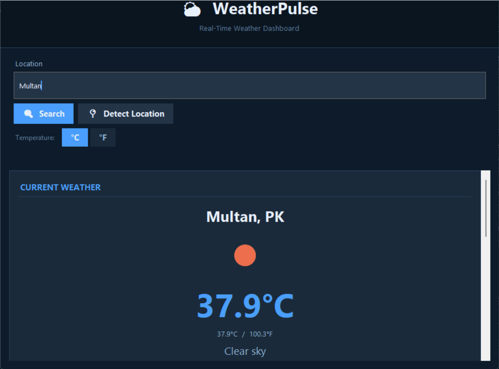
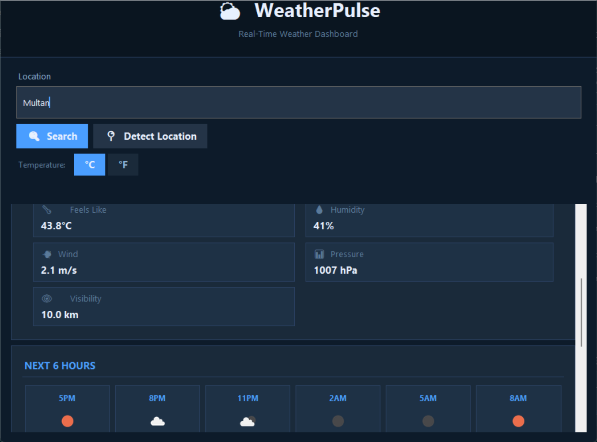

# WeatherPulse

**WeatherPulse** is a professional desktop weather application built with Python and Tkinter.  
It retrieves real-time weather data and forecasts from OpenWeatherMap and presents them in a clean,  
dark-themed dashboard — with current conditions, an hourly 6-hour outlook, and a 5-day forecast.

---

## Features

| Feature | Description |
|---|---|
| **Current Weather** | Temperature, feels-like, humidity, wind speed, pressure, visibility |
| **Dual Units** | Celsius / Fahrenheit toggle — no extra API call required |
| **Weather Icons** | Live icons downloaded from OpenWeatherMap CDN |
| **6-Hour Forecast** | Next 6 forecast slots with icon, temp, and precipitation % |
| **5-Day Forecast** | Daily high/low, condition, and precipitation probability |
| **IP Location** | Optional one-click location detection via ipinfo.io |
| **Responsive GUI** | All API calls run in a background thread; GUI never freezes |
| **Error Handling** | All errors shown inside the GUI — no terminal required |
| **Secure Config** | API keys loaded from `.env` — never hardcoded |
| **Logging** | Rotating log file for debugging; secrets never logged |
| **Tests** | Pytest suite with mocked API responses |

---

## Architecture

```
weatherpulse/
├── app.py                  ← Entry point
├── config/
│   └── settings.py         ← Loads .env, defines constants
├── api/
│   ├── weather_api.py      ← HTTP client for OpenWeatherMap
│   ├── location_api.py     ← IP geolocation via ipinfo.io
│   └── exceptions.py       ← Custom exception hierarchy
├── models/
│   └── weather.py          ← Dataclasses (WeatherData, etc.)
├── services/
│   ├── weather_service.py  ← Orchestrates fetch + normalization
│   └── unit_converter.py   ← °C ↔ °F conversion + formatting
├── utils/
│   ├── validators.py       ← Input validation
│   ├── image_loader.py     ← Icon download with caching
│   └── logger.py           ← Logging configuration
├── gui/
│   ├── theme.py            ← Colors, fonts, widget factories
│   ├── main_window.py      ← Root Tk window, state machine
│   ├── current_weather.py  ← Current conditions panel
│   ├── hourly_forecast.py  ← 6-hour forecast cards
│   └── daily_forecast.py   ← 5-day forecast table
└── tests/
    ├── test_conversion.py
    ├── test_validation.py
    └── test_api.py
```

---

## Requirements

- Python **3.11** or later
- `requests` ≥ 2.31
- `Pillow` ≥ 10.0
- `python-dotenv` ≥ 1.0
- `tkinter` (bundled with standard Python on Windows/macOS; see below for Linux)

---

## Installation

### 1. Clone or download the project

```bash
git clone https://github.com/yourname/weatherpulse.git
cd weatherpulse
```

### 2. Create a virtual environment

```bash
python -m venv .venv
```

**Windows:**
```bash
.venv\Scripts\activate
```

**macOS / Linux:**
```bash
source .venv/bin/activate
```

### 3. Install dependencies

```bash
pip install -r requirements.txt
```

> **Linux users:** If `tkinter` is not installed, run:
> ```bash
> sudo apt install python3-tk   # Debian / Ubuntu
> sudo dnf install python3-tkinter  # Fedora
> ```

---

## Configuration

### 1. Get a free OpenWeatherMap API key

1. Register at <https://openweathermap.org/api>
2. Go to *API keys* in your account dashboard.
3. Copy your key.

### 2. Create the `.env` file

```bash
cp .env.example .env
```

Open `.env` and fill in your key:

```env
OPENWEATHER_API_KEY=your_actual_api_key_here
```

> ⚠️ **Never commit `.env` to Git.** It is already listed in `.gitignore`.

### 3. (Optional) ipinfo.io token

To increase the rate limit for IP-based location detection:

```env
IPINFO_TOKEN=your_ipinfo_token_here
```

Leave it blank to use the free unauthenticated endpoint (60 req/hr).

---

## Running the Application

```bash
python app.py
```

The window will open immediately. If the API key is not configured you will see a  
friendly warning inside the app.

---

## Testing

```bash
python -m pytest tests/ -v
```

All tests use mocked HTTP responses — no real API calls or internet connection needed.

**Expected output:**
```
tests/test_api.py          ✓ (17 tests)
tests/test_conversion.py   ✓ (16 tests)
tests/test_validation.py   ✓ (18 tests)
```

---

## Usage Guide

1. **Search a city** — type a city name (e.g. `London`), city+country (e.g. `London,GB`), or  
   a ZIP code (e.g. `10001,US`) and press **Enter** or click **🔍 Search**.
2. **Detect location** — click **📍 Detect Location** to auto-fill your city via IP geolocation.
3. **Switch units** — click **°C** or **°F** to toggle — no new API call is made.
4. **Scroll down** — hourly and daily forecasts are below the current conditions card.

---

## Troubleshooting

### "No API key found"
Create a `.env` file in the project root and add `OPENWEATHER_API_KEY=your_key`.  
See the [Configuration](#configuration) section.

### "Weather service authentication failed"
Your API key is invalid or has not yet been activated.  
New OpenWeatherMap keys can take up to 2 hours to activate.

### "Location not found"
- Check spelling — use the English city name.
- Try adding a country code: `Paris,FR` or `Sydney,AU`.
- For ZIP codes, append the country: `90210,US`.

### "Unable to connect to the weather service"
Check your internet connection. If behind a proxy, configure it in your environment.

### "Weather service took too long to respond"
OpenWeatherMap may be temporarily slow. Wait a moment and try again.

### Icons not loading
Weather icons are downloaded from OpenWeatherMap CDN.  
If they fail the text condition is shown instead — functionality is unaffected.

### tkinter not found (Linux)
```bash
sudo apt install python3-tk
```

### ImportError / ModuleNotFoundError
Make sure you activated the virtual environment and ran `pip install -r requirements.txt`.

---

## Security Notes

- API keys are loaded from environment variables, never hardcoded.
- The `.env` file is excluded from version control via `.gitignore`.
- API keys are never written to log files.
- All API communication uses HTTPS.
- User input is validated and sanitised before any API call.

---

## Screenshots

>   
>   

---

## Future Enhancements

- Weather alert notifications
- Search history and favourite locations
- Dark / light theme toggle
- Interactive temperature charts
- Air quality index (AQI)
- UV index and sunrise/sunset times
- Offline caching

---

## License

MIT License — see `LICENSE` for details.
